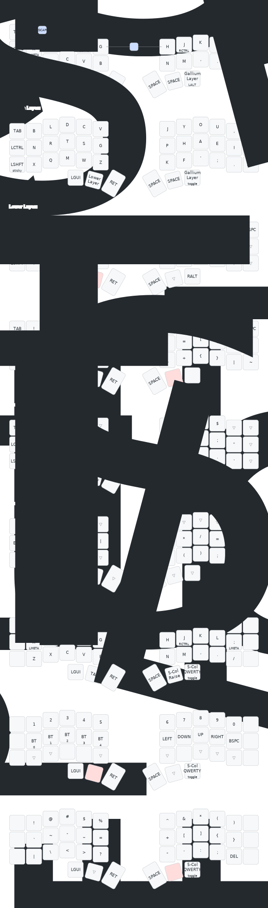

# Corne ZMK Configuration

This repository contains my ZMK firmware configuration for the Corne keyboard (also known as Crkbd), a popular split ergonomic mechanical keyboard with 42 keys.

## Keyboard Layout

Below is a visual representation of my keyboard layout including all layers:



## Features

- **Default Layer**: QWERTY layout with home row mods (GACS) - tap rightmost thumb key to toggle Gallium layer
- **Gallium Layer**: Alternative ergonomic layout - tap rightmost thumb key to return to Default layer
- **Colemak Layer**: Colemak layout with home row mods - accessible via Lower layer
- **Colemak-DH Layer**: Colemak Mod-DH layout with home row mods - accessible via Lower layer
- **5-Column QWERTY**: 5-column QWERTY layout for 5-column keyboard simulation - accessible via Lower layer
- **Lower Layer** (hold left thumb key): Numbers, bluetooth controls, arrow keys, and base layer switching
  - Bottom row includes quick access to switch between base layers: Default (to0), Gallium (to1), 5-Col (to6), Colemak (to9), and Colemak-DH (to10)
- **Raise Layer** (hold right thumb key): Symbols and special characters
- **Symbol Layers**: Additional symbol layers for advanced punctuation
- **Combos**: Escape using Q+W, and Caps Word using both inner thumb keys

## Home Row Mods

The home row keys function as modifiers when held:

- A: Left Meta (GUI)
- S: Left Alt
- D: Left Shift
- F: Left Control
- J: Right Control
- K: Right Shift
- L: Right Alt
- ;: Right Meta (GUI)

## Bluetooth Support

The Lower layer provides Bluetooth controls:

- BT CLR: Clear Bluetooth connections
- BT 0-4: Switch between paired devices

### Dongle Configuration

This repository includes a dongle build configuration that allows using a central controller to connect to both keyboard halves. The dongle configuration includes:

- **Bluetooth Name**: Set to "Nice_Dongle" in the configuration
- **Display Timeout**: Display will turn off after 1 minute of inactivity (configurable in `boards/shields/corne/corne_dongle_pro_micro.conf`)
- **Deep Sleep**: Disabled to ensure the dongle always wakes up on key press from the keyboard halves (increases power consumption on battery, no impact when USB-powered)

**Important**: If your dongle shows the wrong Bluetooth name (e.g., "eyeslash_sofle" from factory settings), you need to flash the `settings_reset` firmware first to clear the stored settings, then flash the dongle firmware again. The settings_reset firmware is automatically built by GitHub Actions.

## Building and Flashing

To build and flash this firmware:

1. Fork this repository
2. Make your changes to the configuration files
3. GitHub Actions will build the firmware automatically
4. Download the firmware files from the Actions tab
5. Flash your keyboard using the appropriate method for your controller

## Customizing

To customize this layout for your own use, modify the following files:

- `config/corne.keymap` - Edit the keymap
- `config/corne.conf` - Adjust keyboard settings

For more information on ZMK configuration, visit the [ZMK Documentation](https://zmk.dev/docs).

## Generating the Layout Image

To visualize your keymap, you can use the [keymap-drawer](https://github.com/caksoylar/keymap-drawer) tool.

### 1. Install keymap-drawer

You need Python 3.7+ and pip installed. Then run:

```bash
pip install keymap-drawer
```

### 2. Generate the YAML keymap

```bash
keymap parse -c 10 -z ./config/corne.keymap > corne_keymap.yaml
```

### 3. Draw the SVG layout

```bash
keymap draw corne_keymap.yaml > corne_keymap.svg
```

The resulting `corne_keymap.svg` will be a visual representation of your keyboard layout.
