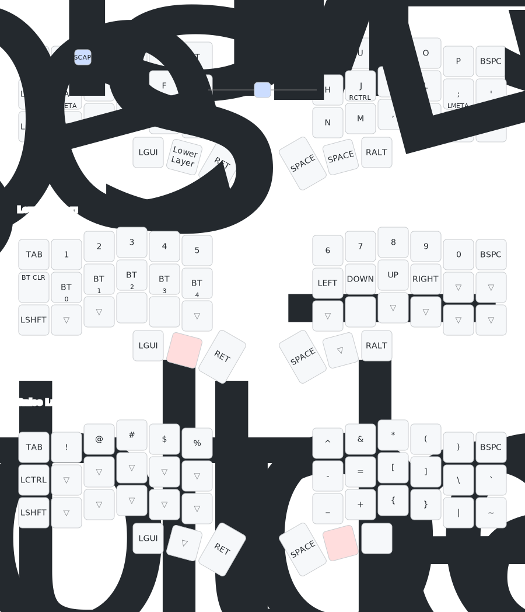

# Corne ZMK Configuration

This repository contains my ZMK firmware configuration for the Corne keyboard (also known as Crkbd), a popular split ergonomic mechanical keyboard with 42 keys.

## Keyboard Layout

Below is a visual representation of my keyboard layout including all layers:

## Features

- **Default Layer**: QWERTY layout with home row mods (GACS)
- **Lower Layer** (accessed by holding the left thumb key): Numbers, bluetooth controls, and arrow keys
- **Raise Layer** (accessed by holding the right thumb key): Symbols and special characters
- **Combos**: Escape using Q+W, and Caps Word using both inner thumb keys

## Home Row Mods

The home row keys function as modifiers when held:

- A: Left Meta (GUI)
- S: Left Alt
- D: Left Shift
- F: Left Control
- J: Right Control
- K: Right Shift
- L: Right Alt
- ;: Right Meta (GUI)

## Bluetooth Support

The Lower layer provides Bluetooth controls:

- BT CLR: Clear Bluetooth connections
- BT 0-4: Switch between paired devices

## Building and Flashing

To build and flash this firmware:

1. Fork this repository
2. Make your changes to the configuration files
3. GitHub Actions will build the firmware automatically
4. Download the firmware files from the Actions tab
5. Flash your keyboard using the appropriate method for your controller

## Customizing

To customize this layout for your own use, modify the following files:

- `config/corne.keymap` - Edit the keymap
- `config/corne.conf` - Adjust keyboard settings

For more information on ZMK configuration, visit the [ZMK Documentation](https://zmk.dev/docs).
